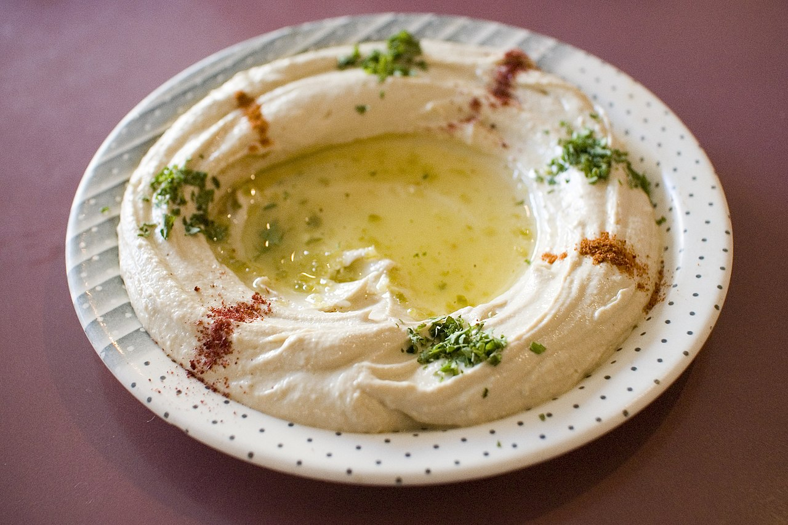

# 素材について

- 本教材は、クリエイティブ・コモンズのCC0 1.0 パブリック・ドメイン提供ライセンスによる、https://github.com/mdn/learning-area/blob/main/html/introduction-to-html/html-text-formatting/text-start.html の素材を日本語訳したものです。
  - クリエイティブ・コモンズ CC0 1.0 について
    https://creativecommons.org/publicdomain/zero/1.0/deed.ja

- 画像素材は、Wikipediaよりダウンロードしました。
  - フムスの画像 :  https://ja.wikipedia.org/wiki/%E3%83%95%E3%83%A0%E3%82%B9#/media/%E3%83%95%E3%82%A1%E3%82%A4%E3%83%AB:Hummus_from_The_Nile.jpg 
    - 著作者 : Paul Goyette - https://www.flickr.com/photos/pgoyette/235999644/
    - ライセンスは CC BY-SA 2.0です。
		https://creativecommons.org/licenses/by-sa/2.0/deed.ja

# 解説

- すべてのコンテンツをHTMLの基本構造の中に入れます。`title要素`に「クイックフムスレシピ」を指定しています。なお、テキスト`P.34`にある`<meta name="robots" content="all">`や`<meta name="description" content="#">`、`<meta name="viewport" content="width=device-width, initial-scale=1.0">` はオプションであるため省略していますが、書いてあってもかまいません。
	```
	<!DOCTYPE html>
	<html lang="ja">
	<head>
		<meta charset="UTF-8">
		<title>クイックフムスレシピ</title>
	</head>
	<body>
		...この中にコンテンツを入れます。
	</body>
	</html>
	```

- 画像には指定された幅`width`と高さ`height`、及び`alt属性`を指定しています。
	```
	
	```

- 作り方は手順が重要であるため、`ol`要素を使用して、番号付きリストとしています。
	```
	<h2>作り方</h2>
	<ol>
		<li>ニンニクは皮を取り除き、粗く刻む。</li>
		<li>ピーマンは種とヘタを取り、粗く刻む。</li>
		<li>すべての材料をフードプロセッサーに入れる。</li>
		<li>すべての材料をペースト状にする。</li>
		<li>粗めの "もっちりした "フムスにしたい場合は、短時間で処理する。</li>
		<li>滑らかなフムスにしたい場合は、長めに処理する。</li>
	</ol>
	```
- 一方で、材料の一覧には順番はありません。箇条書きである`ul`要素を使用しています。
	```
	<h2>材料</h2>
	<ul>
		<li>ひよこ豆（ガルバンゾ豆）1缶（400g)</li>
		<li>タヒニ 175g</li>
		<li>サンドライドトマト 6個</li>
		<li>赤唐辛子 半個</li>
		<li>カイエンペッパー少々</li>
		<li>ニンニク 1片</li>
		<li>オリーブオイル 適量</li>
	</ul>
	```
- 以下のメッセージはこのレシピが特別なものであり、このレシピに目を留めて欲しいことを訴えています。そのため、`b要素`を使用して読者の注意を引くようにしました。
	```
	<b>このレシピは、私が長年にわたって読んできた様々なレシピから転用したものです。</b>
	```
- 以下のメッセージは、腐って食べられないことを示しており、利用者に危険性を訴えるものです。単に目を引くだけではなく、より高い重要性を持つコンテンツを示す`strong要素`の利用が適しています。（`b要素`には重要性という意味が無く、単にその部分に注意を引かせる目的で使用します。）
	```
	<strong>発泡してきた場合は、必ず捨ててください。</strong>
	```

